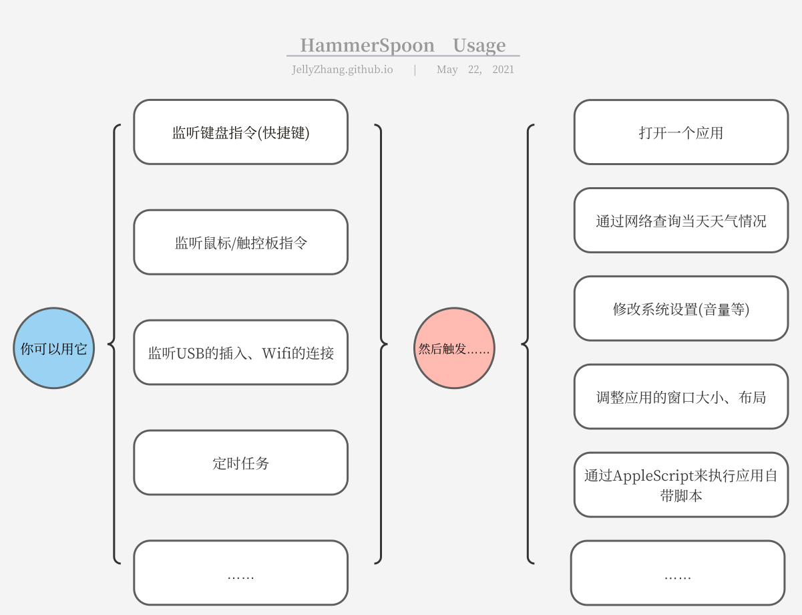

# 效率开发工具


# 效率开发工具

## hammerSpoon (macos)

[hammerSpoon](https://www.hammerspoon.org/) 是 Macos 下的一款开源的可编程脚本软件，支持以 API 的形式让用户来编写可操作系统的脚本。用一张图来概括：





图片中未列出的其他操作，包括但不限于：

- 以屏幕为画布来画图
- 弹出对话框让用户选择选项
- 搭建一个简易 Http 服务器
- 让你的音乐软件（Spotify、Vox）等暂停、下一曲。
- 展现一个网页内容
- ……

总而言之，

- 基于 lua 脚本语言。https://learnxinyminutes.com/docs/lua/

- fast app switch

  

  ALT + 单个键组合快速切换 APP

  my config：

  

- 设备管理（监听、触发）

  - 音频设备
  - 键盘、鼠标（map keys like vim in non-vim env）
  - USB

- 系统设备监听

  - wifi event、usb event、audio device event

- 窗口管理

- app 自带的 Application Script

- 其他 API

  - network、timer、httpserver、dialog……

- 可编写自己的状态栏应用

  - 

    - 通过系统 api 获取定位
    - 通过免费的天气预报来获取天气信息
    - 通过 alertAPI 来用气泡提醒
    - more actions……

  - 剪贴板历史

    

- its ability is only limited by your imagination

- some ideas

  - 在插入 usb 鼠标时，更改系统的滚轮策略
  - 连接、断开 wifi 时播出指定的音乐
  - 定时将 workspace 里的 git 项目都 commit、push 来存档
  - 一键输出当前时间戳
  - 。。。

- some links

  - https://www.v2ex.com/t/553241
  - https://sspai.com/post/53992
  - https://zhuanlan.zhihu.com/p/72499152

### vim

- use [neovim](https://github.com/neovim/neovim) in 2020 (neovim 可视为 vim 的超集、modern vim)

- vim vs IDE

  - pros：
    - fast typing、 words edit
    - 支持自定义脚本
    - 轻量级，可在服务器运行
    - 得益于微软 lsp（ _Language Server Protocol_）的推行，vim 的编程提示方面可以做到与 IDE 一样的体验
    - 基本上你需要的 IDE 功能，都有人实现过相应的 vim 插件
  - cons：
    - 调试 debug 不太方便，最好依赖本地 ide 的远程调试功能
    - 复制不太利索

- 建议的 vim mapping

  - ijkl instead of hjkl
  - 配套的 hammerSpoon 设置

- vim in chrome

  - extension： vimium
  - pros：
    - 可满足简单的无鼠标浏览网页
    - 支持修改 mapping
  - cons:
    - 复杂的网页操作仍然需要鼠标、没有鼠标快

- vim in IDE

  - pros：能 work 及简单的 mapping

  - cons：不支持自定义的插件

- vim in everything

  - 大部分 commandLine tool，若里面有涉及到“选择”、“光标移动”等，都是 hjkl 的默认配置。(tmux 等)
  - 习惯 vim 后会想把快捷键思维代入其他软件

- some links

  - 推荐入门视频：https://www.bilibili.com/video/BV164411P7tw

### 效率之谈

- shortcut key > mouse

- leftside keyboard > rightside keyboard

- 

- 尽可能地将双手保持在左侧区域。

- 右手切换到鼠标、方向键再切换回来耗时巨大。

- apprroachs

  - vim

  - hammerSpoon map keys like vim （alt + ijkl)

    

### typora + 免费图床

- pros：
  - 所见即所得，即时渲染的 markdown
  - 免费图床：摆脱 markdown 自身不保存资源的劣势

### docker container as dev-env

- 防止本身的环境装太多软件，太乱。
- 使用 Dockerfile 来搭建一个符合你要求的开发环境
- 使用 docker 的 volumn 功能来将本地的项目文件映射到容器的 workspace 中

### commandLine tools

- fzf：模糊查找

  

- ranger：命令行中的文件资源管理器

  

- tmux：终端会话工具

### 坚果云

- 作为备份云盘
- pros：
  - 国内环境下网速较好
  - 支持全平台 app
  - 支持版本回滚
  - 免费版个人使用足够

```

```

